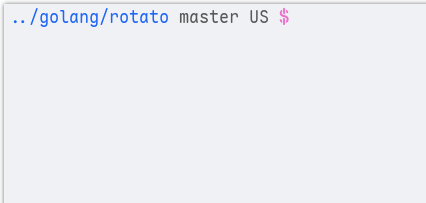

<div>

<h1><b><span style="font-size: 1.2em">🌀</span> Rotato</b></h1>


[](https://pkg.go.dev/github.com/haaag/rotato)

Lightweight and highly customizable spinner library for Go, designed to enhance your command-line applications with visually appealing progress indicators. With **42** spinners to choose from, you can easily integrate dynamic loading animations into your projects.

<br>
</div>

<div align="center">



</div>

## 🎬 More demos

You can check out the spinners with the following commands:

```sh
# simple demo.
go run github.com/haaag/rotato/example@latest -demo

# all registered rotatos.
go run github.com/haaag/rotato/example@latest -all
```

## 📦 Installation

```sh
go get github.com/haaag/rotato@latest
```

## 🚀 Example

There is a example in the [example](https://github.com/haaag/rotato/blob/master/example/main.go) folder.

```go
r := rotato.New(
    rotato.WithPrefix("Repo"),
    rotato.WithSpinnerColor(rotato.ColorBrightGreen),
    rotato.WithDoneColorMesg(rotato.ColorBrightGreen, rotato.ColorStyleItalic),
    rotato.WithFailColorMesg(rotato.ColorRed, rotato.ColorStyleBlink),
)
r.Start()
// do some stuff
repo := git.New("https://github.com/haaag/rotato")
r.UpdateMesg("Syncing Repo...")
if err := repo.Sync(); err != nil {
    r.Fail("Sync Failed!")
    return err
}
r.Done("Sync Completed!")
```

## 🗨️ Credits

This package uses `symbols/spinners` from this libraries, and of course ideas!

Thanks to:

- [@briandowns](https://github.com/briandowns/spinner)
- [@theckman](https://github.com/theckman/yacspin)
